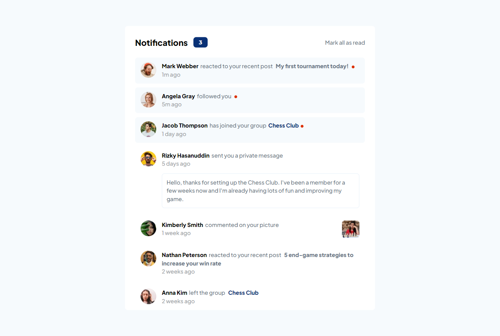
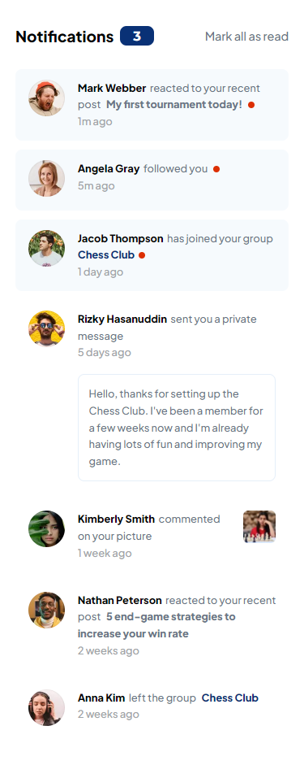

# Frontend Mentor - Notifications page solution

This is a solution to the [Notifications page challenge on Frontend Mentor](https://www.frontendmentor.io/challenges/notifications-page-DqK5QAmKbC).

## Table of contents

- [Overview](#overview)
  - [The challenge](#the-challenge)
  - [Screenshot](#screenshot)
  - [Links](#links)
  - [Built with](#built-with)
  - [What I learned](#What-I-learned)

## Overview

### The challenge

Users should be able to:

- Distinguish between "unread" and "read" notifications
- Select "Mark all as read" to toggle the visual state of the unread notifications and set the number of unread messages to zero
- View the optimal layout for the interface depending on their device's screen size
- See hover and focus states for all interactive elements on the page

### Screenshot

## Desktop View



## Mobile View



### Links

- Solution URL: [Add solution URL here](https://your-solution-url.com)
- Live Site URL: [https://silver-kelpie-ad315c.netlify.app/](https://silver-kelpie-ad315c.netlify.app/)

## My process

### Built with

- Semantic HTML5 markup
- SASS
- Flexbox
- JavaScript

### What I learned

DOM manipulation and how to organize HTML sturcture meaningfully so that we can access childs and parents easily.

```js
const unread = document.querySelectorAll(".unread");
const markButton = document.getElementById("mark");
const dot = document.querySelectorAll(".red-dot");
const count = document.getElementById("count");

markButton.addEventListener("click", () => {
  unread.forEach((item) => {
    item.classList.remove("unread");
  });
  dot.forEach((item) => {
    item.classList.remove("red-dot");
  });
  count.innerHTML = "0";
});

unread.forEach((item) => {
  item.addEventListener("click", () => {
    item.classList.remove("unread");
    item.children[1].children[0].children[1].classList.remove("red-dot");
    item.children[1].children[0].children[2]
      ? item.children[1].children[0].children[2].remove("red-dot")
      : null;
    count.innerHTML = Number(count.innerText) - 1;
  });
});
```
